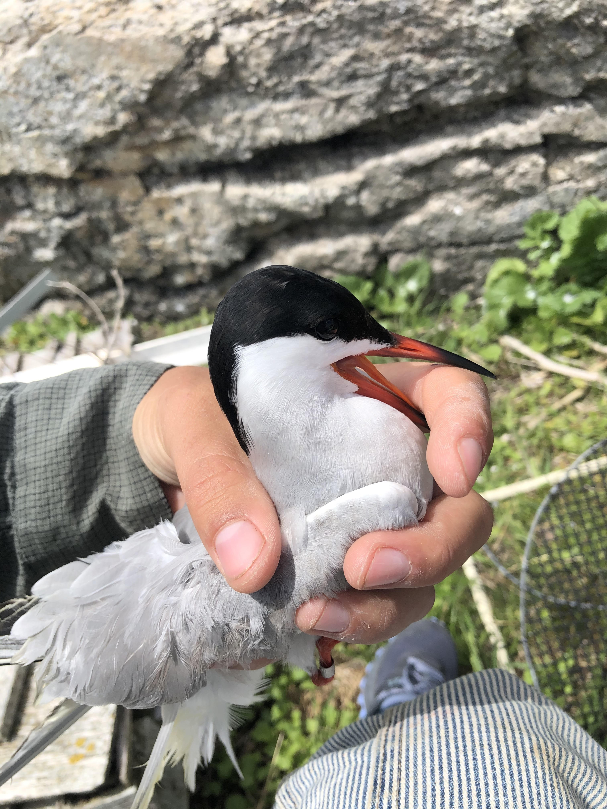
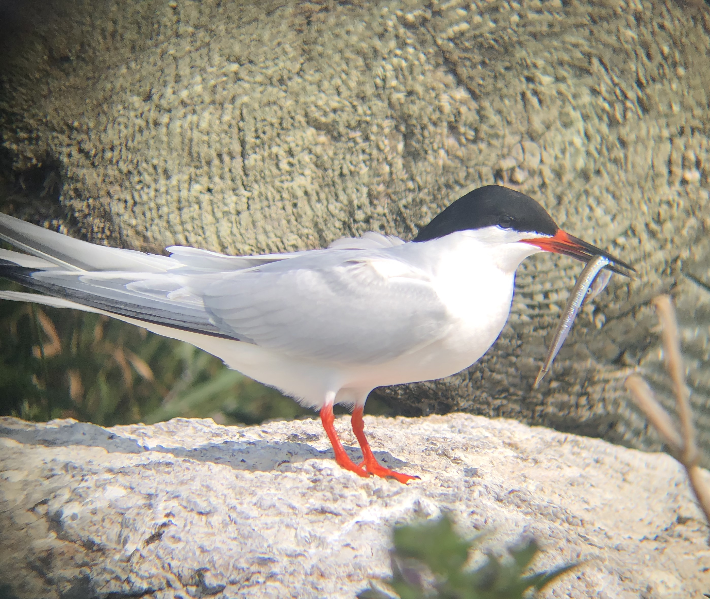
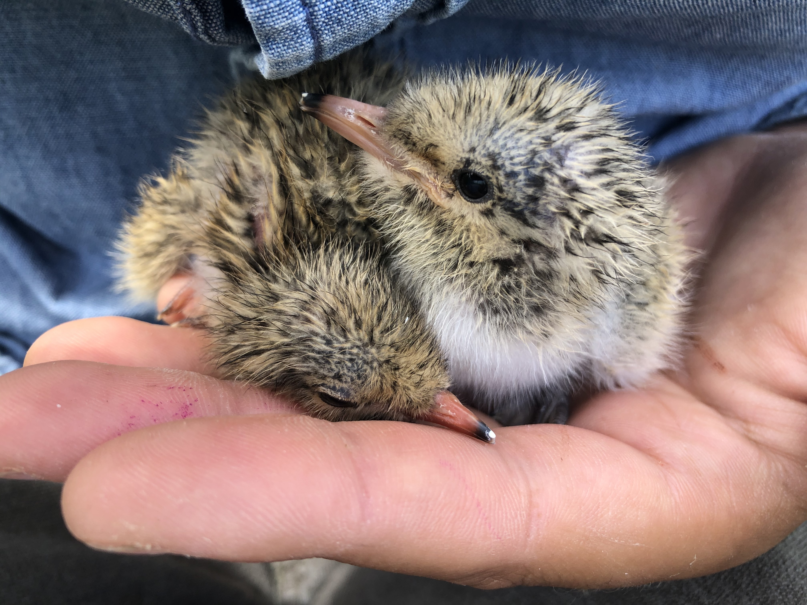
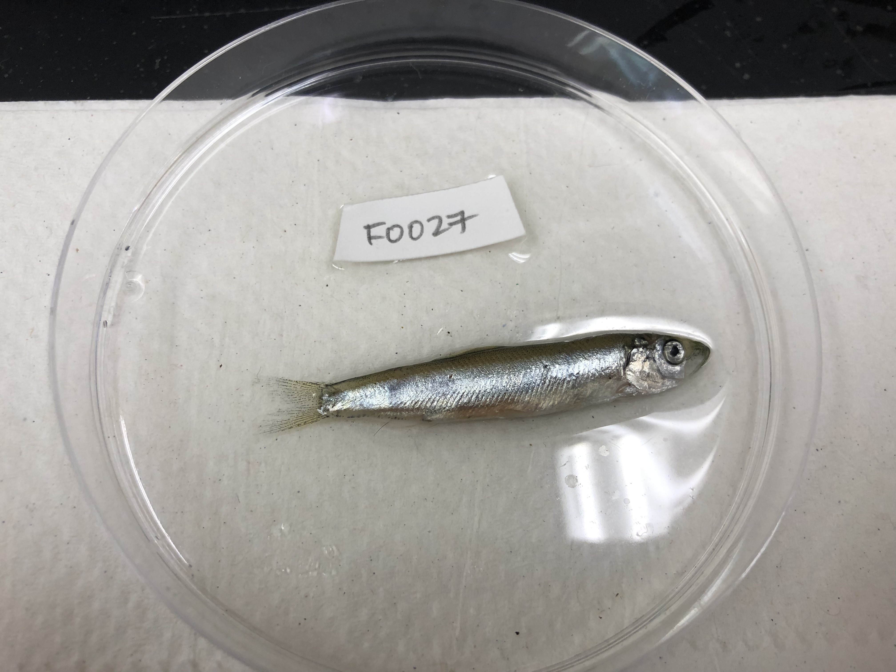
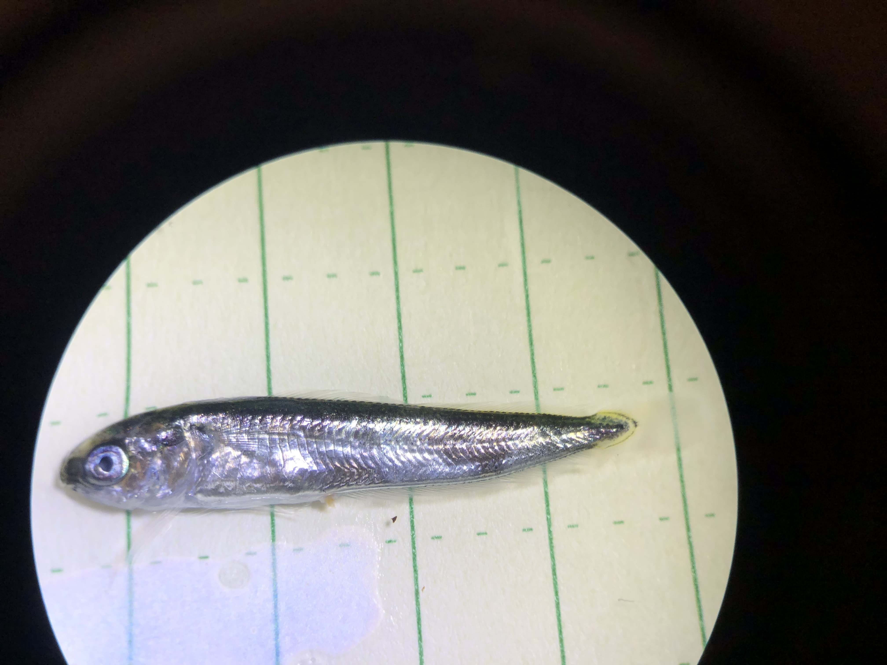
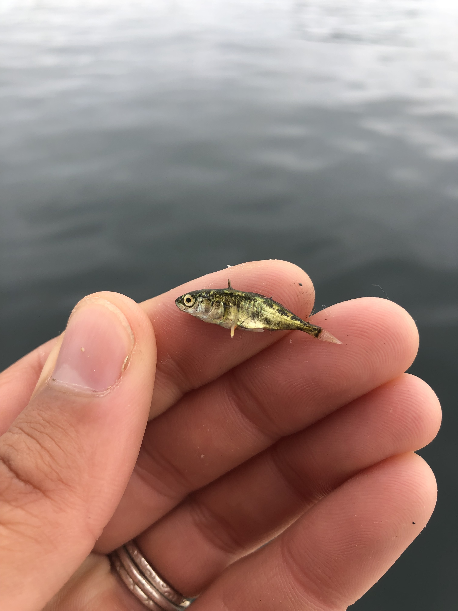
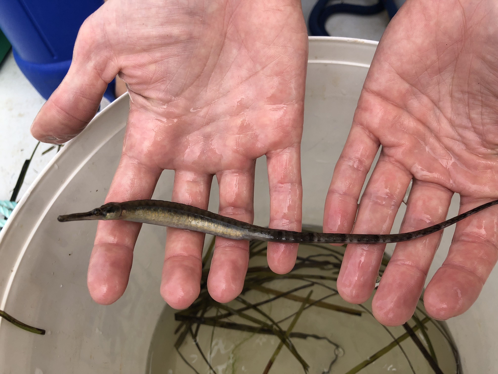
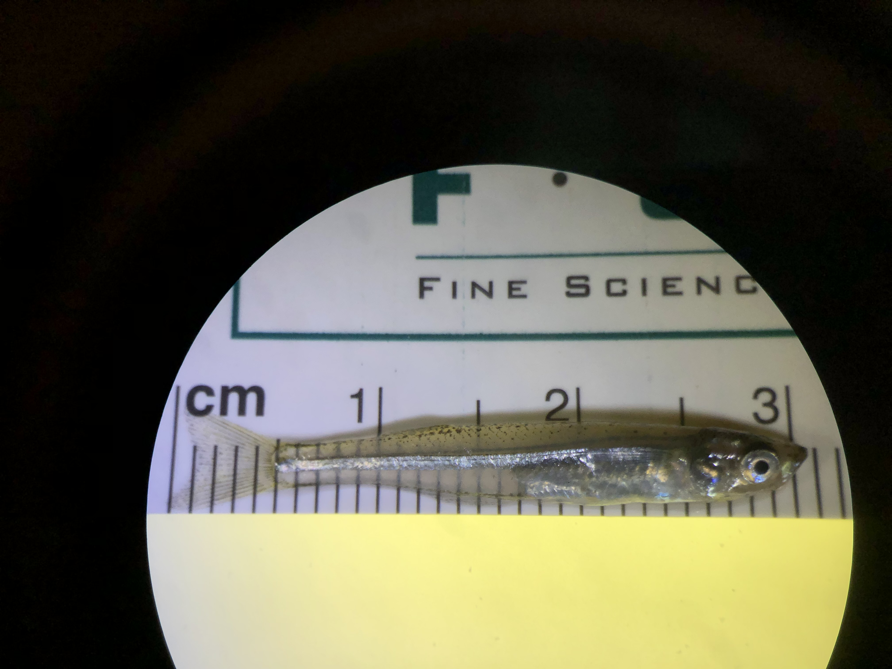
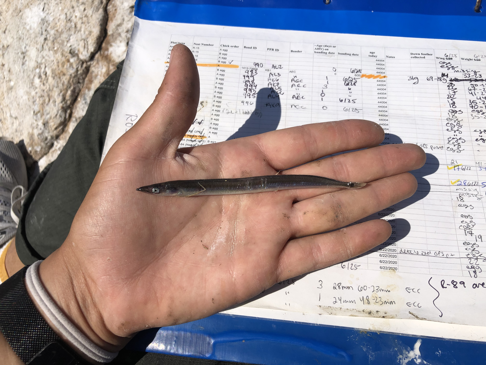
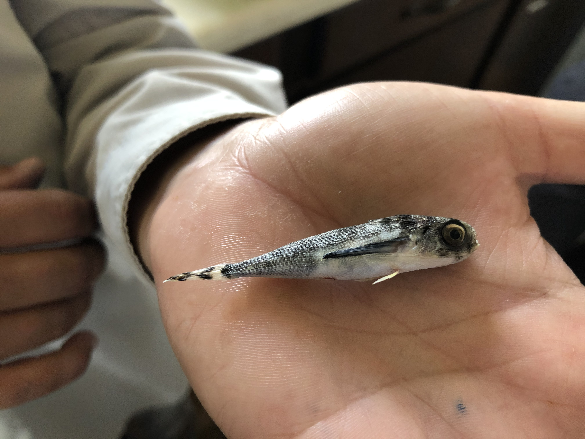

My research explores seabird movement and trophic ecology as it relates to fisheries monitoring. Specifically, I investigate how seabirds utilize their foraging environment, how seabirds select prey items from their environment, and how those two pieces of information can helps us utilize seabird diet as a fisheries monitor and predictor.

Here are photos of some of my study species:

{width=250px}   {width=250px}   {width=250px}

{width=250px}   {width=250px}   {width=250px}

{width=250px}   {width=250px}   {width=250px}

{width=250px}

Lastly, here is the coolest fish ever, a flying gurnard

{width=250px}